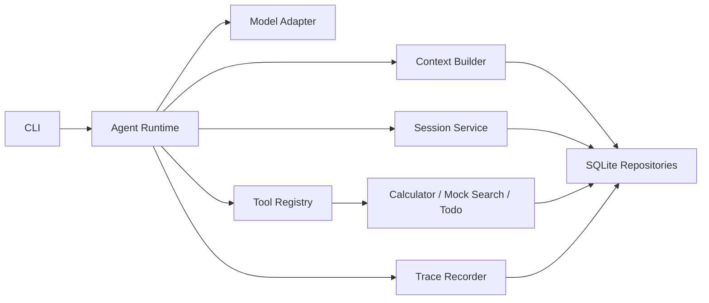
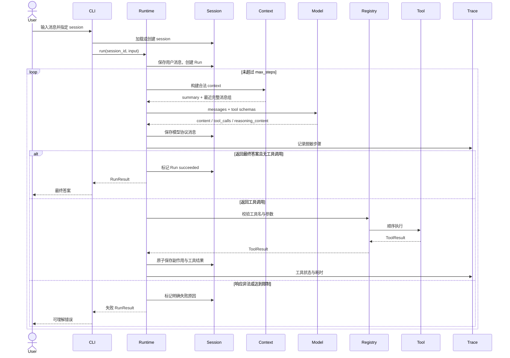

# 《最小可用 Agent》系统骨架

> 基于方案 A：DeepSeek 原生 Tool Calls + 自建有限循环 + SQLite 分层状态。
> 目标：固定足够支撑编码的边界，不展开类实现、SQL 或算法细节。

## 1. 模块关系



依赖原则：上层只能通过接口调用下层；Model Adapter 不执行工具，Tool 不调用模型，CLI 不直接读写数据库。

## 2. 目录结构

```text
minimum-viable-agent/
├── pyproject.toml
├── .env.example
├── README.md
├── src/
│   └── mva/
│       ├── __main__.py
│       ├── config.py
│       ├── errors.py
│       ├── domain/
│       │   └── models.py
│       ├── cli/
│       │   ├── commands.py
│       │   └── presenter.py
│       ├── runtime/
│       │   ├── agent.py
│       │   └── decisions.py
│       ├── model/
│       │   ├── base.py
│       │   └── deepseek.py
│       ├── tools/
│       │   ├── base.py
│       │   ├── registry.py
│       │   ├── calculator.py
│       │   ├── mock_search.py
│       │   └── todo.py
│       ├── session/
│       │   └── service.py
│       ├── context/
│       │   ├── builder.py
│       │   └── compactor.py
│       ├── storage/
│       │   ├── database.py
│       │   ├── schema.py
│       │   └── repositories.py
│       └── observability/
│           ├── trace.py
│           └── redaction.py
├── prompts/
│   ├── agent_system.md
│   └── context_summary.md
├── acceptance/
│   ├── fixtures/
│   └── scenarios/
├── docs/
└── var/
    └── agent.db
```

`var/`、本地 `.env` 和验收输出不得提交到 Git。

## 3. 各模块职责

| 模块 | 单一职责 | 不负责 |
|---|---|---|
| `cli` | session 操作、读取用户输入、展示答案/错误/决策摘要 | 模型调用、SQL、工具执行 |
| `runtime` | Agent 有限循环、分支判断、步骤预算、终止状态 | 具体 API、具体工具逻辑 |
| `model` | DeepSeek 请求/响应转换，保留协议字段 | loop、工具执行、session 策略 |
| `tools` | 工具定义、Schema 校验、白名单分发和执行 | 决定何时调用工具 |
| `session` | 创建、列出、加载和恢复 session | 拼装模型 context |
| `context` | 从持久状态构建合法模型消息，触发基础压缩 | 保存 todo、执行工具 |
| `storage` | SQLite 连接、事务、Schema 版本和仓储实现 | 业务决策 |
| `observability` | 脱敏 trace、run/step 关联、耗时与错误记录 | 保存原始思维链 |
| `domain` | 跨模块共享的数据类型与状态枚举 | 外部 IO |
| `acceptance` | 固定响应源、验收场景和结果记录 | 生产运行逻辑 |

## 4. 核心接口或 API

以下是逻辑接口，命名可微调，行为边界不应改变。

| 接口 | 核心操作 | 输入 → 输出 |
|---|---|---|
| `AgentRuntime` | `run` | `session_id + user_input` → `RunResult` |
| `ModelClient` | `complete` | `ModelRequest` → `ModelResponse` |
| `ToolRegistry` | `register / specs / invoke` | `ToolSpec`；或 `ToolCall + ToolContext` → `ToolResult` |
| `ContextBuilder` | `build` | `session_id` → `ModelContext` |
| `ContextCompactor` | `should_compact / compact` | 历史消息 → `CompactionResult` |
| `SessionService` | `create / list / get / resume` | session 条件 → `Session` |
| `SessionRepository` | `append_message / load_messages / update_summary` | session 范围内数据 |
| `TodoRepository` | `add / list` | 必须携带 `session_id` |
| `RunRepository` | `start / finish / fail` | `Run` 状态变化 |
| `TraceRecorder` | `emit` | `TraceEvent` → 无业务返回值 |
| `Redactor` | `sanitize` | 任意 trace payload → 可安全记录的 payload |

最小 CLI 行为：

- 创建 session；
- 列出可恢复 session；
- 按 session ID 进入对话；
- 退出当前对话。

具体命令拼写不属于稳定接口，CLI 能力属于稳定接口。

## 5. 关键数据结构

| 数据结构 | 最小字段 | 关键约束 |
|---|---|---|
| `Session` | `id`、`title?`、`summary?`、`compacted_through_seq`、时间戳、状态 | `id` 全局唯一；summary 仅属于该 session |
| `StoredMessage` | `id`、`session_id`、`seq`、`role`、`content?`、`reasoning_content?`、`tool_calls?`、`tool_call_id?`、时间戳 | `(session_id, seq)` 有序；内部推理不可进入展示层 |
| `Run` | `id`、`session_id`、状态、`step_count`、`stop_reason`、开始/结束时间、错误码 | 每次用户输入对应一个 run |
| `ModelRequest` | 模型名、消息列表、工具 Schema、thinking 配置 | 不包含 API Key；消息必须满足 provider 格式 |
| `ModelResponse` | `content?`、`reasoning_content?`、`tool_calls[]`、`finish_reason`、usage | 空答案和非法工具调用不能视为成功 |
| `ToolSpec` | `name`、`description`、`parameters_schema` | 名称唯一；Schema 可验证 |
| `ToolCall` | `id`、`name`、`arguments` | `id` 用于与结果配对 |
| `ToolResult` | `tool_call_id`、`ok`、`output?`、`error?` | 成功与失败互斥；不能伪造成功 |
| `ToolContext` | `session_id`、`run_id`、允许的仓储能力 | 工具不能获得全局数据库访问权 |
| `Todo` | `id`、`session_id`、内容、状态、时间戳 | 所有查询与变更必须限定 session |
| `TraceEvent` | `run_id`、`session_id`、step、事件类型、脱敏 payload、耗时、错误 | 不含 API Key 和原始推理 |
| `RunResult` | 状态、最终答案?、停止原因、run ID | 状态只能是成功或一种明确失败 |

建议的状态枚举：

- Run：`running / succeeded / failed / max_steps`；
- Todo：`open`；完成/删除不属于当前 P0；
- 决策：`direct_answer / tool_call / tool_result / continue / stop`。

## 6. 必须守住的数据不变量

1. 任意 session 数据读写都必须显式携带 `session_id`。
2. `tool_call` 与对应的 `tool_result` 必须通过同一个 call ID 配对。
3. 一次模型响应先持久化，再进入后续工具步骤；run 的最终状态只能写入一次。
4. todo 变更与其成功工具结果应处于同一原子边界，避免“已新增但模型收到失败”。
5. 同一模型响应中的多个工具调用按顺序执行；P0 不做并行工具调用。
6. Context 压缩只处理已闭合的历史交互组，不拆分工具调用链。
7. 原始 `reasoning_content` 可以为协议连续性保存在本地内部状态，但不得进入 CLI、普通 trace、README 或录屏。
8. 决策摘要由 Runtime 根据动作类型生成，不从原始思维链截取。

## 7. 主链路时序



Context 压缩在进入新的模型请求前判断；不得在一个尚未闭合的工具调用链中间压缩。

## 8. 权限、隔离和边界

### 8.1 权限

- API Key 只从环境读取，只传给 Model Adapter。
- Tool 只能通过 `ToolContext` 获得最小能力：
  - `calculator` 无存储、网络或系统权限；
  - mock `search` 只读固定 fixture，不访问网络；
  - `todo` 只能访问当前 session 的 Todo Repository。
- 未注册工具、非法参数和任意代码表达式一律拒绝执行。

### 8.2 隔离

- session 隔离同时覆盖消息、summary、内部模型状态、todo、run 和 trace。
- Repository 层不提供“无 session 条件的业务查询”。
- 测试和验收使用独立临时数据库，不接触真实运行数据。
- `var/agent.db` 依赖本地操作系统文件权限；本项目不实现多用户权限系统。

### 8.3 明确边界

- 支持不同 session 在不同 CLI 进程中恢复；不承诺同一 session 的并发写入。
- 支持同一模型响应返回多个工具调用，但 P0 串行执行。
- todo 仅保证新增和查看；完成、修改、删除不在 P0。
- search 是 mock，不具备实时性。
- 不提供 Web、远程 API、多 Agent、RAG 或跨 session 用户记忆。

## 9. 尚未完全锁定的边界

以下事项不阻塞模块编码，但在进入对应模块前需定值：

| 边界 | 当前约束 | 需要锁定的内容 |
|---|---|---|
| Context 压缩 | 接口固定；只能压缩闭合历史组 | 使用 LLM 摘要还是规则摘要，以及失败回退行为 |
| 容量预算 | 必须可配置并可在验收中稳定触发 | `max_steps`、压缩阈值、最近消息保留量的默认值 |
| Mock 搜索数据 | 必须确定、可复现并标识 mock | fixture 主题、字段和查询匹配规则 |
| 内部推理落盘 | 允许仅为协议连续性保存在本地 DB | 是否要求静态加密；当前 P0 仅依赖本地文件权限 |
| 同 session 并发 | 当前不承诺并发写 | 若要求两个进程同时操作同一 session，需要追加并发控制设计 |
| Trace 保留 | 必须脱敏且可复盘 | 保留周期和清理方式；当前本地 MVP 可不自动清理 |
